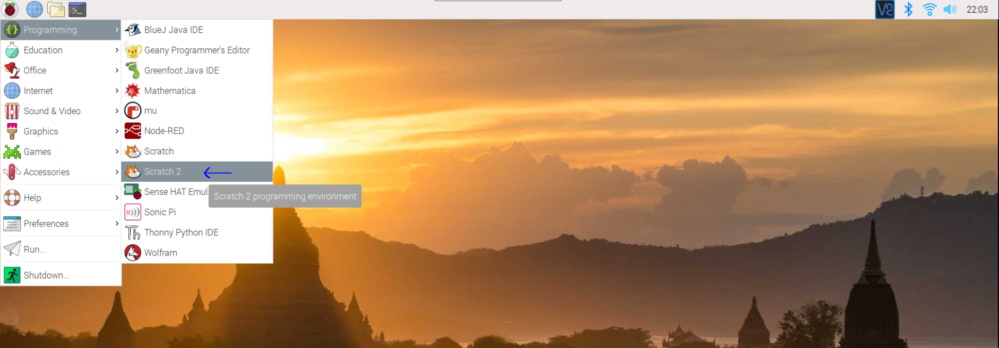
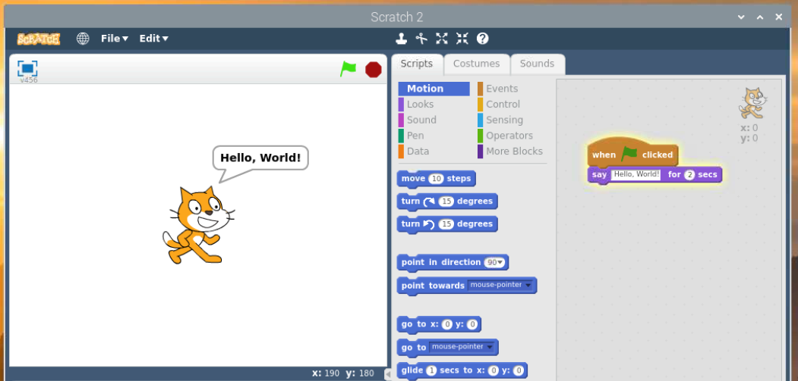
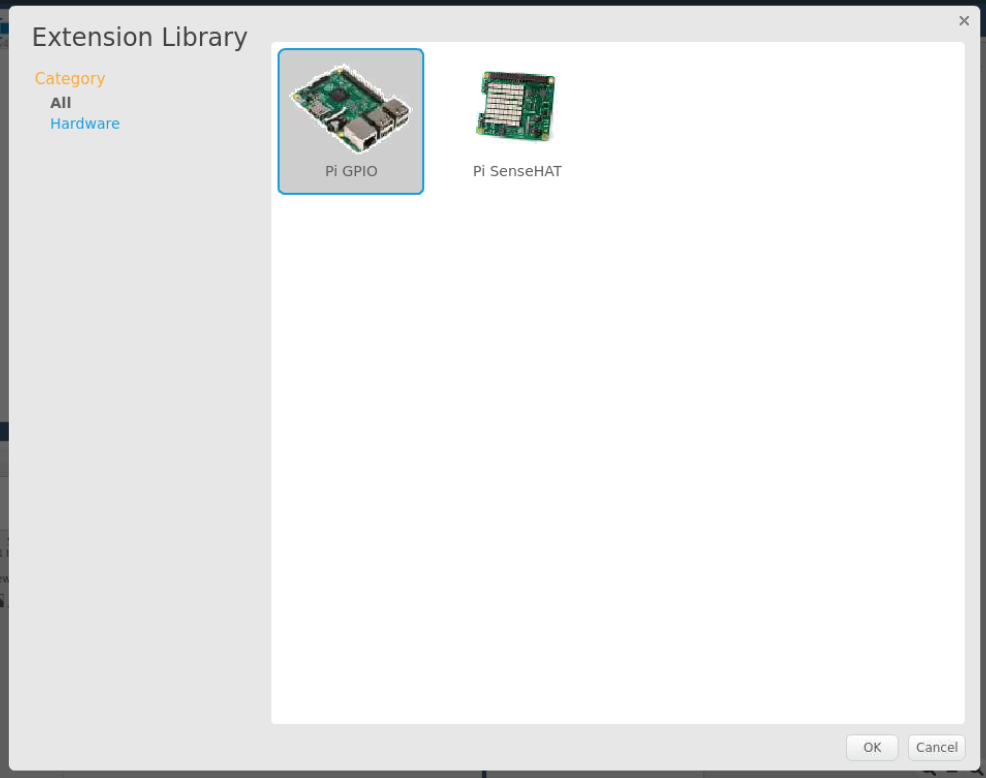
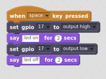

# Intro to the Raspberry Pi

* [LCD1602 Notes](./LCD1602_guide.md)


This repository will contain notes, images, and code samples for MakerspaceCT's Intro to the Raspberry Pi course.

* Scratch
* bash
* Python

## Scratch2

Scratch2 is a block-based, visual programming language developed by the MIT Media Lab's Lifelong Kindergarten Group. It is targeted primarily at children, teaching programming structure without the need for complex syntax.

Scratch3 was released in early 2019, but browser-based-only at this time.

### Get started:
Start by opening Scratch2

*Raspberry Menu -> Programming -> Scratch2*

Most blocks are color-coded by category. You can see which categories the blocks in each example came from my looking at the color-coded bar next to the category names.










## bash (bourne-again shell)

### Hello, World!
`echo "Hello, World!"`

### Executing a bash script.
```
bash blink.sh
```

or

```
./blink.sh
```
*If using the second option, you must first ensure that you have permission to execute the script. See [this stackoverflow question](https://stackoverflow.com/questions/8779951/how-do-i-run-a-shell-script-without-using-sh-or-bash-commands) on how to execute a shell script without using the "bash" command.*


### Is a space allowed between #! and /bin/bash? (from [stackexchange](https://unix.stackexchange.com/questions/276751/is-space-allowed-between-and-bin-bash-in-shebang))

Yes, this is allowed.

The Wikipedia article [about the shebang](https://en.wikipedia.org/wiki/Shebang_(Unix)#History) includes a 1980 email from Dennis Ritchie, when he was introducing kernel support for the shebang (as part of a wider package called interpreter directives) into Version 8 Unix (emphasis mine):

The system has been changed so that if a file being executed begins with the magic characters #!, the rest of the line is understood to be the name of an interpreter for the executed file. […]

To take advantage of this wonderful opportunity, put

`#! /bin/sh`
at the left margin of the first line of your shell scripts. Blanks after ! are OK.

So spaces after the shebang have been around for quite a while, and indeed, Dennis Ritchie’s example is using them.

Note that early versions of Unix had a limit of 16 characters in this interpreter line, so you couldn’t have an arbitrary amount of whitespace there. This restriction no longer applies in modern kernels

## Python

### Hello, World!
`print("Hello, World!")`

### Executing a python script.
```
python blink.py
```

**or**

Open the IDLE IDE for Python (preloaded on your Raspberry Pi), which includes a Python shell and a system to quickly execute your files.


## What to buy:
* [Raspberry Pi 3 Model B+](https://www.arrow.com/en/products/raspberrypi3b/raspberry-pi-foundation) - this is the latest (and most powerful) Raspberry Pi computer.

### You'll also need

* [Smraza Starter Kit](https://www.amazon.com/Smraza-Starter-Ultrasonic-Distance-Raspberry/dp/B01MATM4XF/ref=sr_1_2?ie=UTF8&qid=1546989796&sr=8-2&keywords=smraza+raspberry+pi+arduino) - While this is the kit used in class, it's not necessarily better than any similar kit. I like this kit specifically because it includes the ribbon cable and T-Plus breakout board for connecting the GPIO pins to your breadboard.
* 8GB+ MicroSD Card (Class 10) - Any "Class 10" or "UHS-I" will work fine. I have a bulk supplier I use, but these can be readily found from Amazon, Newegg, Best Buy, or a number of other retailers.
* [5v, 2.5a MicroUSB Power Supply](https://www.amazon.com/CanaKit-Raspberry-Supply-Adapter-Listed/dp/B00MARDJZ4) - Again, this is not "THE" power supply to buy. You may have a cell phone charger that will function adequately. The important note is that the Raspberry Pi 3 Model B+ requires 2.5 Amps, so an older phone charger may not provide enough power.
* USB Keyboard/Mouse - I like the [Logitech K400](https://www.amazon.com/Logitech-Wireless-Keyboard-Control-Touchpad/dp/B014EUQOGK) wireless keyboard/trackpad combo, but any USB keyboard and mouse will do.
* HDMI Cable - or the appropriate cable for the display you plan to use. The monitors here all have HDMI input, so we use HDMI-to-HDMI cables, but at home my monitor only has DVI input, so I use an HDMI-to-DVI cable.

If you have any questions, ask!
